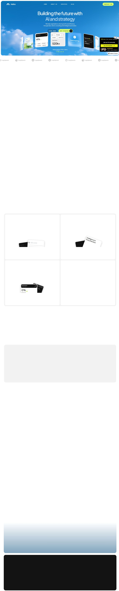

# DESIGN.md: Aeline (aeline.framer.website)

## Source
- URL: https://aeline.framer.website/
- Capture date: 2026-06-29
- Evidence: Firecrawl-style capture via dev-browser (full-page screenshot + computed-style token extraction) and WebFetch content/structure pass.

## Reference Screenshot

> Note: Aeline lazy-loads sections on scroll, so the captured full-page screenshot renders the hero crisply while mid-page sections appear blank (their reveal animations had not fired). Tokens below were read from the live computed styles, not the screenshot, so they are accurate.

## Design Summary
Aeline is a clean, airy, modern **AI/SaaS consulting** aesthetic. The signature traits are:
- A **light sky-blue cloud-gradient hero** with a cluster of floating, slightly-rotated 3D "dashboard" cards (glassy product UI mockups).
- **Plus Jakarta Sans** typography set at **medium weight (500)** — never heavy/bold — at large sizes with **aggressively tight negative letter-spacing** (this is the most recognizable cue).
- A restrained neutral palette (white / near-black `#131313` / light gray `#F2F2F2`) punctuated by a single loud **lime-chartreuse accent** used only as button fills and small highlights.
- **Pill-shaped buttons** (fully rounded, 48px radius) — primary = lime fill with dark text, often with a small **circular icon button inset on the right edge**; secondary = dark `#131313` fill.
- `Geist Mono` for small labels, stats, and eyebrow text.

## Design Tokens

### Colors
| Role | Value | Notes |
|------|-------|-------|
| Background (primary) | `#FFFFFF` | dominant page bg |
| Surface (soft) | `#F2F2F2` | alternating section / card bg |
| Ink (near-black) | `#131313` | headings, dark cards, secondary buttons |
| Ink 50% | `rgba(19,19,19,0.5)` | muted text on light |
| Muted text | `#7B7B7B` | body / captions |
| **Accent — Lime** | `#D6FD70` | primary CTA fill (observed) |
| **Accent — Lime bright** | `#CDFB56` | hover / alt CTA fill |
| Accent — Lime yellow | `#EBF213` | rare highlight |
| Accent — Sky | `#38C6F6` | small UI accents in mockups |
| White 75% | `rgba(255,255,255,0.75)` | text on dark |

> The `rgb(0,0,238)` seen in extraction is the browser default unstyled-anchor blue (inside Framer link wrappers) — **not** a brand color; ignore it.

### Typography
- **Primary family:** `"Plus Jakarta Sans", sans-serif`
- **Mono / labels:** `"Geist Mono", monospace`
- **Heading weight:** `500` (medium) — do NOT use 700/800.
- **Type scale (observed):**
  - H1 — `60px`, weight 500, line-height `72px`, letter-spacing **`-3.6px`** (≈ `-0.06em`)
  - H2 — `48px`, weight 500, line-height `56.16px`, letter-spacing **`-2.88px`** (≈ `-0.06em`)
  - Body — sans, regular, generous line-height, muted gray
- **Rule of thumb:** letter-spacing ≈ `-0.055em` to `-0.06em` on all large display text.

### Spacing And Layout
- Centered max-width container, generous vertical section rhythm (large `py`).
- Radius: pills = `9999px` (`48px` observed); cards = large rounded (`~20–28px`).
- Card style: white or light-gray surfaces, soft shadow, thin hairline borders; "feature" cards arranged in a 2×2 grid with floating mini-UI props inside.
- Logo strip ("Logoipsum") directly under hero as social proof.
- Hero floating cards are rotated a few degrees (perspective/3D feel).

## Components
- **Primary button:** lime `#D6FD70` pill, dark `#131313` text, uppercase or sentence label, optional circular dark icon-button inset on the right (padding like `4px 4px 4px 16px` to seat the circle).
- **Secondary button:** dark `#131313` pill, light text; or translucent outline pill.
- **Nav:** light, minimal, centered links (Home / About us / Services / Blog), right-aligned pill CTA ("Contact us" / "Get started").
- **Cards:** rounded, soft-shadow, hairline border; product-mockup props inside.
- **Pricing:** three-tier, one emphasized (dark) card.
- **Testimonials:** quote cards + aggregate rating (4.9/5).
- **Footer:** dark, large CTA statement + nav columns.

## Page Patterns
Section order: Hero → logo strip → about → metrics (3 stats) → services (3) → expertise (2) → transformation timeline → growth stats → UX section → 3-tier pricing → testimonials (4) → blog (3) → trust/community CTA → footer.

## Content Style
Confident, B2B, data-driven. CTAs: **"Get Started"** (repeated), "View demo", "Contact us", "View all", "Join our AI community". Headlines are short declaratives ("Building the future with AI and strategy").

## Agent Build Instructions (applied to BTechTutor)
Keep BTechTutor's existing copy/data; re-skin into Aeline's language:
1. Swap fonts → Plus Jakarta Sans (headings @ weight 500) + Geist Mono (stats/eyebrows). Apply `tracking-[-0.055em]` to all large headings.
2. Repalette → white/`#F2F2F2` light base, `#131313` ink, **lime `#D6FD70`** as the single accent (replaces amber), sky `#38C6F6` as a secondary tint.
3. Hero → light sky-blue cloud-gradient background with a floating cluster of rotated dashboard/cred cards instead of the dark charcoal hero.
4. Buttons → fully-rounded pills; primary = lime fill + dark text + circular icon inset; secondary = dark/outline pill.
5. Cards → light surfaces, soft shadow, hairline border, large radius; emphasized pricing card = dark `#131313` with lime CTA.
6. Keep section rhythm light/airy; alternate white and `#F2F2F2`.

## Rerun Inputs
workflow: firecrawl-website-design-clone
source_url: https://aeline.framer.website/
target_stack: Next.js (App Router) + Tailwind + GSAP + Lenis
output: DESIGN.md
